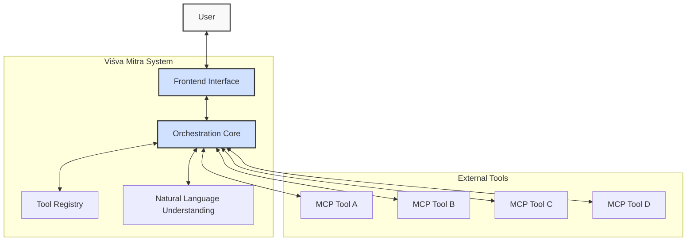

# System Architecture Overview

## High-Level Architecture

The diagram below illustrates the high-level architecture of Viśva Mitra:

## Core Components

The Viśva Mitra system consists of several key components:

### 1. Frontend Interface
- Provides user interaction channels (web, mobile, API)
- Handles authentication and session management
- Renders responses in appropriate formats

### 2. Orchestration Core
- Central component managing the flow of requests and responses
- Makes decisions about tool selection and sequencing
- Handles error cases and fallback strategies

### 3. Tool Registry
- Maintains metadata about available tools
- Stores information about tool capabilities and requirements
- Enables dynamic discovery of new tools

### 4. Natural Language Understanding (NLU)
- Processes user input to extract intent and entities
- Maps user requests to potential tool actions
- Helps generate natural language responses

### 5. MCP Tool Integration
- Standardized protocol for tool communication
- Authentication and permission management
- Request/response formatting and validation

